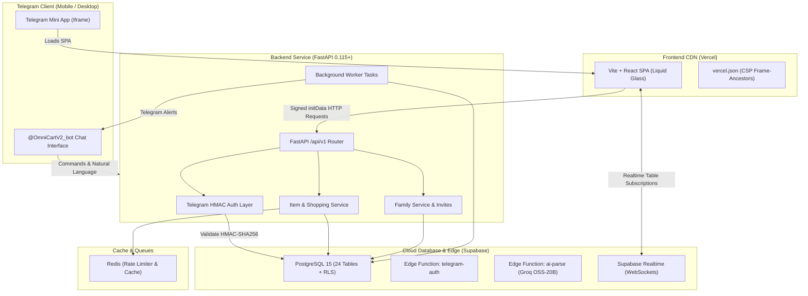

# OMNICART AI 2.0 — TARGET ARCHITECTURE SPECIFICATION
**Artifact ID:** `02-target-architecture.md`  
**Execution Phase:** Phase 4 (Target Architecture)  
**Version:** 2.0.0  

---

## 1. High-Level System Topology

---

## 2. Authentication Flow (Zero-Trust HMAC Verification)

1. **Client Initiation:**
   The user opens the Mini App from `@OmniCartV2_bot`. The Telegram native container provides `window.Telegram.WebApp.initData`, a cryptographically signed query string containing user identity, `auth_date`, `query_id`, and `hash`.

2. **Transport:**
   `frontend/src/api/client.ts` attaches `X-Telegram-Init-Data: <initData>` on every outbound HTTP request to `/api/v1/*`.

3. **Backend Verification (`backend/app/core/security.py`):**
   - Extracts `hash` from the parameters.
   - Reconstructs `data_check_string` by sorting remaining key-value pairs alphabetically separated by newlines (`\n`).
   - Derives `secret_key = HMAC-SHA256("WebAppData", TELEGRAM_BOT_TOKEN)`.
   - Computes `computed_hash = HMAC-SHA256(secret_key, data_check_string)`.
   - Compares hashes using constant-time comparison `hmac.compare_digest`.
   - Rejects if `auth_date > now + 60s` (future) or `now - auth_date > 3600s` (expired).

4. **User Resolution (`backend/app/services/auth_service.py`):**
   - Retrieves user from PostgreSQL by `telegram_user_id`.
   - If new user: registers user, provisions default shopping list (`"My Shopping List"`), and creates default `UserSettings`.
   - Updates `last_seen_at`.
   - Returns verified canonical user instance to route dependency injection.

---

## 3. Database Isolation Architecture (Non-Recursive RLS)

All 24 database tables enforce Row Level Security. To prevent infinite recursion (`42P17`) between interdependent tables:
- An isolated schema `internal` houses `SECURITY DEFINER` helper functions:
  - `internal.is_list_owner(_list_id, _user_id)`
  - `internal.is_list_member(_list_id, _user_id)`
  - `internal.is_family_member(_family_id, _user_id)`
  - `internal.is_family_admin(_family_id, _user_id)`
- Direct table RLS policies delegate membership checks to `internal.*`, maintaining $O(1)$ query evaluation time and zero performance warnings.
